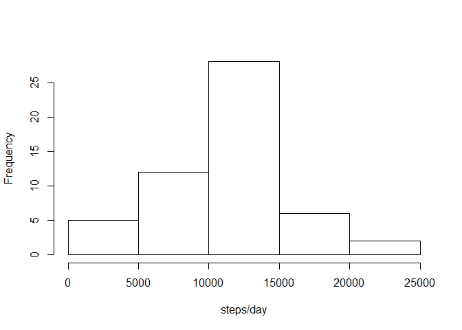
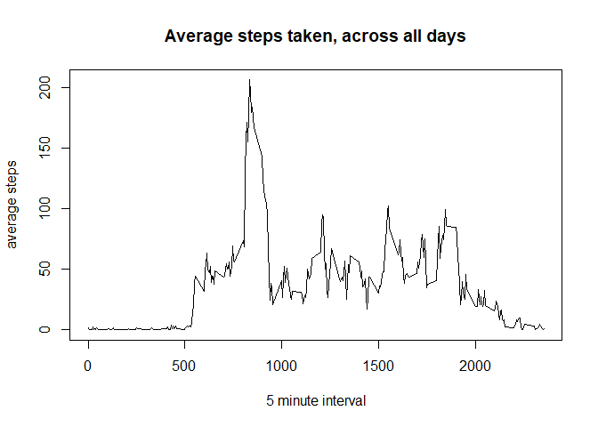
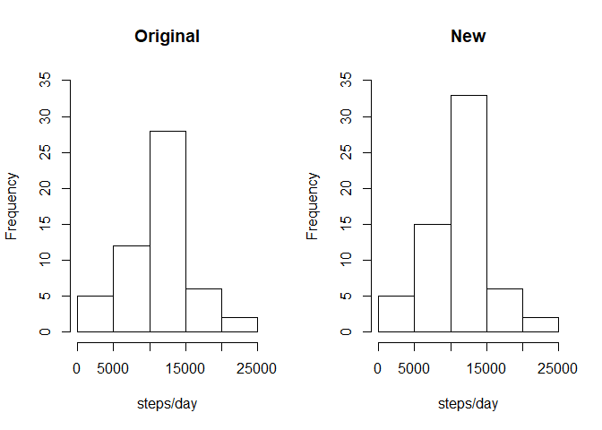
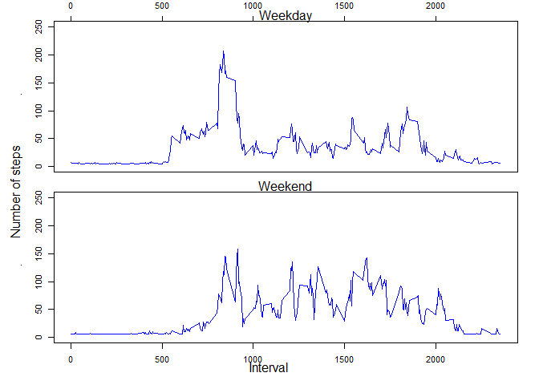

## Introduction
This HTML file was written through knitr from an R markdown file for the
Reproducible Research Assignment.


## Loading and preprocessing the data+
First, the needed libraries are loaded.


```r
library("lubridate")
```

```
## 
## Attaching package: 'lubridate'
```

```
## The following object is masked from 'package:base':
## 
##     date
```

```r
library("dplyr")
```

```
## 
## Attaching package: 'dplyr'
```

```
## The following objects are masked from 'package:lubridate':
## 
##     intersect, setdiff, union
```

```
## The following objects are masked from 'package:stats':
## 
##     filter, lag
```

```
## The following objects are masked from 'package:base':
## 
##     intersect, setdiff, setequal, union
```

The data will be read from the working directory.

```r
data<-read.csv("activity.csv", colClasses=c("numeric","Date","numeric"))
```
## What is mean total number of steps taken per day?

dplyr's aggregate function is used to create a data frame with the total number
of steps taken per day. The column names are set to "date" and "steps".

```r
tsteps<-aggregate(data$steps, list(data$date), FUN=sum)
colnames(tsteps)<-c("date", "steps")
```
A histrogram of the total steps taken per day is plotted with the base plot package.

```r
hist(tsteps$steps, main= "", xlab="steps/day")
```

<!-- -->


Both mean and median are also calculated.

```r
mean(tsteps$steps, na.rm=TRUE)
```

```
## [1] 10766.19
```

```r
median(tsteps$steps, na.rm=TRUE)
```

```
## [1] 10765
```
## What is the average daily activity pattern?
dplyr's aggregate function is used to create a data frame with the avg number of
steps taken in a particular interval. Columns are named "interval" and "steps".


```r
avgday<-aggregate(data$steps, list(data$interval), FUN=mean, na.rm=TRUE)
colnames(avgday)<-c("interval", "steps")
```
Said data frame is plotted as a time series plot.


```r
plot(avgday$interval, avgday$steps, type="l", main="Average steps taken, across all days", xlab= "5 minute interval", ylab="average steps")
```

<!-- -->


The interval with the maximum average number of steps is found through subsetting.

```r
avgday$interval[avgday$step==max(avgday$steps)]
```

```
## [1] 835
```

## Imputing missing values

There are missing values in the original data frame.
First, they are accounted for by calling the function length on the subset of 
missing values from the entire data frame.

```r
total.na<-length(data$steps[is.na(data$steps)])
total.na
```

```
## [1] 2304
```

It is then observed that if there is at least 1 missing value in a day, all values
are missing in that day. Said observation is proved below

```r
days.na<-length(tsteps$steps[is.na(tsteps$steps)])
tintervals<-length(avgday$interval)
days.na==total.na/tintervals
```

```
## [1] TRUE
```
The following strategy is used to fill in the missing values.
i) Calculate the mean of steps taken by day.

```r
byday<-aggregate(data$steps, list(format(data$date, "%A")), FUN=mean, na.rm=TRUE)
colnames(byday)<-c("Weekday","steps")
```
ii) Create a new column vector of steps replacing missing values with the mean
of the corresponding day. For example, if there is a Monday missing from the data,
all of the entries of that day will get replaced by 34.63, the mean step/interval
of that day.

```r
complete<-NULL
i<-1
j<-i+287
while(i<=length(data$steps)){
    if(is.na(data[i,1])==TRUE){
        complete<-c(complete,rep(byday$steps[byday$Weekday==format(data$date[i], "%A")],288))
    }else{
        complete<-c(complete, data$steps[i:j])
    }
    i<-i+288
    j<-i+287
}
```
iii) A new data frame object is created by binding the recently created column,
the old dates and intervals. Columns are named "steps", "date", and "interval".


```r
newdata<-data.frame(complete,data$date,data$interval)
colnames(newdata)<-c("steps","date","interval")
```

dplyr's aggregate function is used to create a data frame with the total number
of steps taken per day for this new data set. The column names are set to "date" and "steps".

```r
ntsteps<-aggregate(newdata$steps, list(newdata$date), FUN=sum)
colnames(ntsteps)<-c("date", "steps")
```

Both the histogram for the original data set and the new data set are plotted.

```r
par(mfrow=c(1:2))
hist(tsteps$steps, main= "Original", xlab="steps/day", ylim=c(0,35))
hist(ntsteps$steps, main= "New", xlab="steps/day", ylim=c(0,35))
```

<!-- -->


It can be seen that the new histogram has a higher density close to the mean.
It can also be seen that the population of the sample has grown.
This result is expected after adding 8 days of data based on the mean of days.


The mean and median are both recalculated and shown below.

```r
c(mean(tsteps$steps, na.rm=TRUE),mean(ntsteps$steps))
```

```
## [1] 10766.19 10821.21
```

```r
c(median(tsteps$steps, na.rm=TRUE), median(ntsteps$steps))
```

```
## [1] 10765 11015
```

It can be observed that both mean and median have increased in comparison to the
original sample.
It was expected that the mean would change given that it would only have been conserved
if the 7 days of the week were equally represented on the missing values or the mean for different days was no different.
As for the median, it moved further from the mean, which could imply that the days added had a more active pattern.

## Are there differences in activity patterns between weekdays and weekends?
First a logic vector is created from evaluating the date column from the data set, TRUE represents "Saturday" or "Sunday" " and FALSE represents everyother value.

```r
weekends<-weekdays(data$date)=="Sunday" | weekdays(data$date)=="Saturday"
```
This vector is then converted to a character vector and "TRUE" and  "FALSE" substituted by weekend or weekday, respectively

```r
weekends<-as.character(weekends)
weekends<-sub("FALSE","weekday",weekends)
weekends<-sub("TRUE", "weekend", weekends)
```
The vector is finally converted to a factor one and added to the data frame with no missing values.

```r
weekends<-as.factor(weekends)
newdata<-data.frame(newdata[,1:3],weekends)
```
The average steps per interval per weekday/weekend factor is calculated through dplyr's aggregate function. columns are named "interval", "day/end", and "steps".

```r
newavgday<-aggregate(newdata$steps, list(newdata$interval,newdata$weekends), FUN=mean)
colnames(newavgday)<-c("interval","day/end","steps")
```
Finally, a panel plot is created where the weekend and weekday behaviours are compared.

```r
par(mfrow=c(2,1))
par(cex = 0.7)
par(mar = c(1.9, 3, 0, 0), oma = c(2, 2, 2, 2))
plot(newavgday$interval[1:288], newavgday$steps[1:288], type="l", main="", xlab= "", ylab="Steps", col="blue", ylim=c(0,250), xaxt='n')
mtext("Weekday")
axis(3)
plot(newavgday$interval[289:576], newavgday$steps[289:576], type="l", main="", xlab= "Interval", ylab="Steps", col="blue" , ylim=c(0,250))
mtext("Weekend")
mtext("Number of steps", side=2, outer=TRUE)
mtext("Interval", side=1, outer=TRUE)
```

<!-- -->
